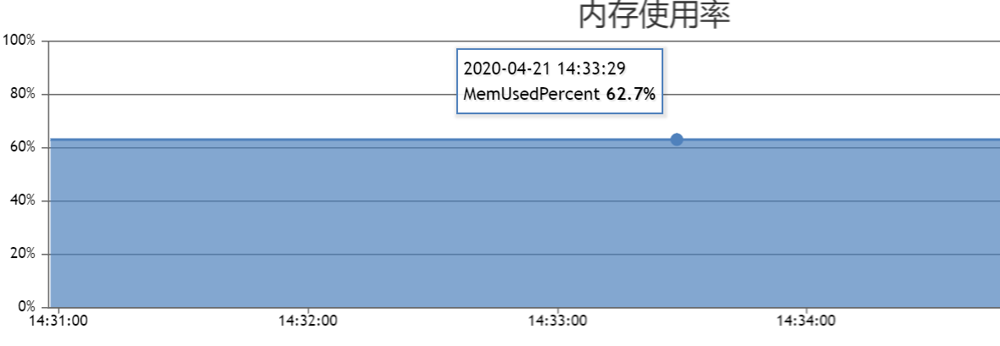
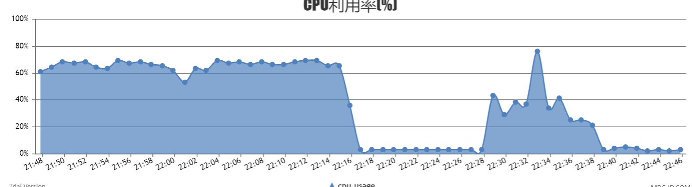

效果评估
----------------

**基准**

本文档显示了我们做的实验和得到的结果。我们做了两个系列的实验。首先，我们在单个节点上进行了基于faiss的改进的Vearch ivfpq模型的召回率实验。其次，基于Vearch 集群进行了实验。

我们使用检索返回的k个候选值（k∈{1，10，100}）是否包含最近邻的结果来计算召回，其中标签通过暴力搜索获得。

实验数据会因为实现、不同机器等的变化而略有变化。

**数据集**

实验分别在128维SIFT特征和512维VGG特征上进行。

**数据集SIFT1M**

可以从如下网址下载ANN_SIFT1M 

http://corpus-texmex.irisa.fr/

**数据集VGG1M 和 VGG10M**

分别收集100万和1000万的图片数据提取VGG特征得到VGG1M （100万）和VGG10M（1000万），其中VGG1M 和VGG10M并不相关。

**数据集VGG100M , VGG500M 和 VGG1B**

另外收集了10亿图片数据来构建VGG100M(1亿) , VGG500M（5亿） 和 VGG1B（10亿）。

**Nprobe 实验**

实验分别在SIFT1M, VGG1M 和 VGG10M上进行。其中ncentroids =256，nbytes = 32，nprobe  ∈{1,5,10,20,30,40,50,80,100,200}。图中数据为recall@1结果。

**结果**

.. image:: pic/nprobe.png
   :align: center
   :scale: 100 %
   :alt: Architecture

可以看到当nprobe超过25后，召回基本上没有明显的变化了。

**Ncentroids 实验**

实验在VGG10M进行。其中nprobe = 50，nbytes = 32， ncentroids∈{64,128,256,512,1024,2048,4096,8192} 。图中数据为recall@1结果。

**结果**

.. image:: pic/ncentroids.png
   :align: center
   :scale: 100 %
   :alt: Architecture

可以看到召回基本不随ncentroids变化而变化，但是ncentroids越大，QPS越高。

**Nbytes 实验**

实验在VGG10M进行。其中nprobe = 50，ncentroids = 256， nbytes ∈{4,8,16,32,64}。图中数据为recall@1结果。

**结果**

.. image:: pic/nbytes.png
   :align: center
   :scale: 100 %
   :alt: Architecture

当nbytes越大，召回越高，当然QPS随之降低。

**对比实验**

实验在 SIFT1M, VGG1M 和 VGG10M 上进行，并与faiss中的一些模型进行对比。

**模型参数**

表格中参数为空，则对应模型不包含该参数。其中 links, efSearch 和 efConstruction 为 faiss 中的 hnsw 定义的参数。

+---------+----------+------+-------------+-------------+------+---------+---------------+
|model    |ncentroids|nprobe|bytes of SIFT|bytes of VGG |links |efSearch |efConstruction | 
+=========+==========+======+=============+=============+======+=========+===============+
|pq       |          |      |32           |64           |      |         |               |
+--------------------+------+-------------+-------------+------+---------+---------------+
|ivfpq    |256       |20    |32           |64           |      |         |               |
+---------+----------+------+-------------+-------------+------+---------+---------------+
|imipq    |2^(2*10)  |2048  |32           |64           |      |         |               |
+---------+----------+------+-------------+-------------+------+---------+---------------+
|opq+pq   |          |      |32           |64           |      |         |               |
+---------+----------+------+-------------+-------------+------+---------+---------------+
|hnsw     |          |      |             |             |32    |64       |40             |
+---------+----------+------+-------------+-------------+------+---------+---------------+
|ivfhnsw  |256       |20    |             |             |32    |64       |40             |
+---------+----------+------+-------------+-------------+------+---------+---------------+
|Vearch   |256       |20    |32           |64           |      |         |               |
+---------+----------+------+-------------+-------------+------+---------+---------------+

**结果**

SIFT1M的召回:

+--------+----------+-----------+------------+
|model   |recall@1  |recall@10  |recall@100  |
+========+==========+===========+============+
|pq      |0.6274    |0.9829     |0.9999      |
+--------+----------+-----------+------------+
|ivfpq   |0.6167    |0.9797     |0.9960      |
+--------+----------+-----------+------------+
|imipq   |0.6595    |0.9775     |0.9841      |
+--------+----------+-----------+------------+
|opq+pq  |0.6250    |0.9821     |1.0000      |
+--------+----------+-----------+------------+
|hnsw    |0.9792    |0.9867     |0.9867      |
+--------+----------+-----------+------------+
|ivfhnsw |0.9888    |0.9961     |0.9961      |
+--------+----------+-----------+------------+
|Vearch  |0.8649    |0.9721     |0.9722      |
+--------+----------+-----------+------------+

VGG1M的召回 :

+--------+----------+-----------+------------+
|model   |recall@1  |recall@10  |recall@100  |
+========+==========+===========+============+
|pq      |0.5079    |0.8922     |0.9930      |
+--------+----------+-----------+------------+
|ivfpq   |0.4985    |0.8792     |0.9704      |
+--------+----------+-----------+------------+
|imipq   |0.5077    |0.8618     |0.9248      |
+--------+----------+-----------+------------+
|opq+pq  |0.5213    |0.9105     |0.9975      |
+--------+----------+-----------+------------+
|hnsw    |0.9496    |0.9550     |0.9551      |
+--------+----------+-----------+------------+
|ivfhnsw |0.9690    |0.9744     |0.9745      |
+--------+----------+-----------+------------+
|Vearch  |0.9536    |0.9582     |0.9585      |
+--------+----------+-----------+------------+

VGG10M的召回 :

+--------+----------+-----------+------------+
|model   |recall@1  |recall@10  |recall@100  |
+========+==========+===========+============+
|pq      |0.5842    |0.8980     |0.9888      |
+--------+----------+-----------+------------+
|ivfpq   |0.5913    |0.8896     |0.9748      |
+--------+----------+-----------+------------+
|imipq   |0.5925    |0.8878     |0.9570      |
+--------+----------+-----------+------------+
|opq+pq  |0.6126    |0.9160     |0.9944      |
+--------+----------+-----------+------------+
|hnsw    |0.8877    |0.9069     |0.9074      |
+--------+----------+-----------+------------+
|ivfhnsw |0.9638    |0.9839     |0.9843      |
+--------+----------+-----------+------------+
|Vearch  |0.9272    |0.9464     |0.9468      |
+--------+----------+-----------+------------+

集群实验
--------

集群实验分别对 VGG100M , VGG500M 和 VGG1B进行实验，并添加是否过滤来进行实验，其中过滤是指在搜索的时候指定过滤条件来缩小搜索范围。VGG100M 搭建了 3 个masters, 3个 routers 和5 个 partition services 的集群。 VGG500M搭建了 3 个masters, 3个 routers 和24个 partition services 的集群。VGG1B搭建了 3 个masters, 6个 routers 和48 个 partition services 的集群。

**结果**

.. image:: pic/cluster.png
   :align: center
   :scale: 100 %
   :alt: Architecture

可以看到当average latency超过一定程度，QPS就不再发生明显变化了。

GPU版性能
--------

**服务器配置**

+-----------+-------------------+
| hardware  |  config           |
+===========+===================+
| CPU       | E5-2683 v4 16cores|
+-----------+-------------------+
| memory    | 16G               |
+-----------+-------------------+
| GPU       | Tesla P40         |
+-----------+-------------------+

数据：128维float数据，总插入数据量2亿

性能：并发20查询，QPS达到3000，tp99在30ms以内

hnsw性能评测
------------

data_size = 10M, 参数为 InnerProduct, nlinks = 32, efConstruction = 40,
efSearch = 64

+--------------------------+----------------+------------+----------------+
| 集群                     | 机器配置       | 数据维度   | 构建索引时间   |
+==========================+================+============+================+
| master，均在一台机器上   | 56核256G内存   | 128        | 28min          |
+--------------------------+----------------+------------+----------------+
| master，均在一台机器上   | 56核256G内存   | 512        | 33min10s       |
+--------------------------+----------------+------------+----------------+
| master，且在不同机器上   | 8核16G内存     | 128        | 2h38m          |
+--------------------------+----------------+------------+----------------+

内存使用率

以8核16G机器为样本进行分析，vearch ps共使用内存16G \* 0.627 =
10.032G，其中原始数据特征大小为10M \* 128 \* 4 ~
5G，其它为索引以及正排字段占用内存。使用时仅创建一个正排字段和向量字段。

10M数据, 机器配置56核256G，add time = 28min01s,
左侧是构建索引CPU利用率，右侧是搜索时CPU利用率

.. figure:: pic/hnsw128_cpu.png
   :alt: 

+---------+--------------+----------+-----------+--------+---------+
| model   | 返回结果数   | 并发数   | QPS       | tp99   | tp100   |
+=========+==============+==========+===========+========+=========+
| HNSW    | 100          | 2000     | 5069.48   | 959    | 1944    |
+---------+--------------+----------+-----------+--------+---------+
| HNSW    | 100          | 1000     | 4680.62   | 521    | 994     |
+---------+--------------+----------+-----------+--------+---------+
| HNSW    | 100          | 100      | 4508.33   | 49     | 86      |
+---------+--------------+----------+-----------+--------+---------+
| HNSW    | 100          | 50       | 4146.55   | 22     | 35      |
+---------+--------------+----------+-----------+--------+---------+
| HNSW    | 100          | 10       | 2048.43   | 8      | 117     |
+---------+--------------+----------+-----------+--------+---------+
| HNSW    | 100          | 1        | 182.74    | 9      | 160     |
+---------+--------------+----------+-----------+--------+---------+

10M数据，机器配置56核256G，d = 512, add time =
33min10s，左侧是构建索引CPU利用率，右侧是搜索时CPU利用率

+---------+--------------+----------+-----------+--------+---------+
| model   | 返回结果数   | 并发数   | QPS       | tp99   | tp100   |
+=========+==============+==========+===========+========+=========+
| HNSW    | 100          | 2000     | 4194.72   | 1181   | 2650    |
+---------+--------------+----------+-----------+--------+---------+
| HNSW    | 100          | 1000     | 4058.59   | 628    | 1059    |
+---------+--------------+----------+-----------+--------+---------+
| HNSW    | 100          | 100      | 3784.56   | 57     | 172     |
+---------+--------------+----------+-----------+--------+---------+
| HNSW    | 100          | 50       | 3723.75   | 24     | 43      |
+---------+--------------+----------+-----------+--------+---------+
| HNSW    | 100          | 10       | 1248.46   | 15     | 1208    |
+---------+--------------+----------+-----------+--------+---------+
| HNSW    | 100          | 1        | 142.70    | 12     | 71      |
+---------+--------------+----------+-----------+--------+---------+

10m数据，机器配置8核16G，d = 128, add time = 2h38m

构建索引时CPU使用率基本保持在100%，
搜索时cpu使用率，当并发数为50，100时，可以看到cpu使用率已经100%，故不做并发数1000/2000的对比实验

.. figure:: /pic/hnsw8c_128_cpu.png
   :alt: 

+---------+--------------+----------+-----------+--------+---------+
| model   | 返回结果数   | 并发数   | QPS       | tp99   | tp100   |
+=========+==============+==========+===========+========+=========+
| HNSW    | 100          | 100      | 888.25    | 279    | 402     |
+---------+--------------+----------+-----------+--------+---------+
| HNSW    | 100          | 50       | 1126.06   | 95     | 199     |
+---------+--------------+----------+-----------+--------+---------+
| HNSW    | 100          | 10       | 918.50    | 15     | 31      |
+---------+--------------+----------+-----------+--------+---------+
| HNSW    | 100          | 1        | 91.74     | 14     | 25      |
+---------+--------------+----------+-----------+--------+---------+

召回评测使用sift1M

+---------+-----------------------------------------------------------------+------------+-------------+--------------+
| model   | parameters                                                      | recall@1   | recall@10   | recall@100   |
+=========+=================================================================+============+=============+==============+
| HNSW    | InnerProduct, nlinks = 32, efConstruction = 40, efSearch = 64   | 0.9769     | 0.9852      | 0.9852       |
+---------+-----------------------------------------------------------------+------------+-------------+--------------+

